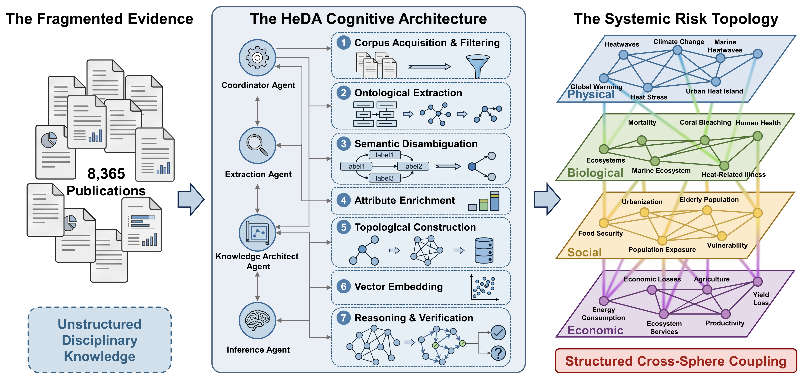

# HeDA: AI-Driven Discovery of Bio-Ecological Mediation in Cascading Heatwave Risks

This repository contains the reproducible code and data for the paper.



## Repository Structure

```
code/           Python scripts (numbered 1-13, run sequentially)
config/         Configuration files
Dataset_S1_WOS_Records.csv   Supplementary Dataset S1 (8,365 WoS records)
```

## Code Overview

| Script | Description |
|--------|-------------|
| `1_data_to_json.py` | Knowledge graph extraction from WoS abstracts (4-layer ontology) |
| `2_sample_fulltext.py` | Stratified sampling of 80 OA full-text papers |
| `3_pdf_to_markdown.py` | PDF to Markdown conversion (Doc2X API) |
| `4_fulltext_extract.py` | Full-text triple extraction |
| `5_fulltext_compare.py` | Abstract vs. full-text comparison analysis |
| `6_entity_merge_eval.py` | Entity deduplication evaluation (5 thresholds) |
| `7_topology_sensitivity.py` | Topology & NoveltyScore sensitivity analysis |
| `8_layer_sensitivity.py` | Layer-merge sensitivity (3 experiments) |
| `9_multihop_generate.py` | Multi-Hop LBD Benchmark generation |
| `10_multihop_evaluate.py` | Table 1 evaluation (4 models x {No-KG, +KG}) |
| `11_traceability_showcase.py` | Provenance figure & Table S1 generation |
| `12_data_availability.py` | Dataset S1 generation |
| `13_figure_generation.py` | All data-driven figures in the paper |

## Setup

1. Copy `config/api_keys.yaml.template` to `config/api_keys.yaml` and fill in your API keys.
2. Install dependencies: `pip install openai numpy networkx faiss-cpu matplotlib seaborn scipy scikit-learn pyyaml`
3. Run scripts in order: `python code/1_data_to_json.py`, `python code/2_sample_fulltext.py`, etc.
